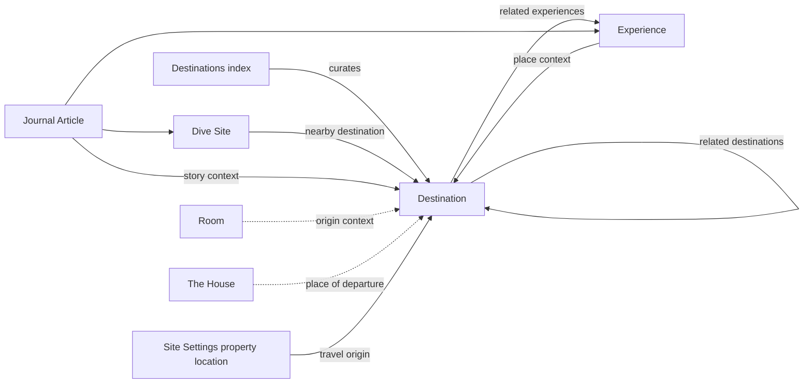

# Joshua's Point — Destination System

## Status and scope

This document defines the technical and editorial architecture for the Joshua's Point Destination
System. It extends the direction established in
[`SANITY_CONTENT_MODEL.md`](./SANITY_CONTENT_MODEL.md) without implementing schemas, queries, or
frontend routes.

The system will eventually support destinations, scooter rides, waterfalls, lakes, coffee stops,
viewpoints, beaches, islands, towns, restaurants, nature, and cultural places. It must remain one
coherent editorial guide rather than becoming a catalogue of attractions.

## 1. Vision

Joshua's Point should become the best editorial guide to exploring southern Negros: observant,
locally informed, practical, and quiet.

The guide should help guests discover places slowly rather than consume attractions. A destination
page should communicate the character of the journey, the atmosphere of arrival, and the context a
guest needs to visit thoughtfully. It should never read like a ranked list, tourism brochure,
business directory, or collection of promotional claims.

The system follows six principles:

1. **The place comes before the product.** Landscape, people, weather, and local context lead.
2. **The journey matters.** Roads, changing terrain, stops, and travel rhythm are part of the story.
3. **Editorial and practical information remain distinct.** Facts support the narrative without
   overwhelming it.
4. **First-hand knowledge is preferred.** Time-sensitive guidance must be locally verified and
   dated.
5. **Independent discovery is supported responsibly.** Directions never replace judgment, local
   advice, access rules, or safety guidance.
6. **Nature and communities are treated with care.** Sensitive locations, customs, and ecological
   conditions take precedence over reach or search traffic.

### Success criteria

The Destination System succeeds when a guest can:

- Understand why a place deserves time without being sold an attraction.
- Decide whether the journey suits their transport, confidence, and available daylight.
- Find reliable orientation and an accessible alternative to an interactive map.
- Continue naturally into a related experience, dive site, or journal story.
- Recognize the Joshua's Point editorial voice on every page.

Page views, map opens, and onward reading can later provide useful signals. They should not create
rankings, popularity badges, or design pressure toward high-volume tourism.

## 2. Information architecture

### Public routes

| Route                  | Responsibility                                                                                            |
| ---------------------- | --------------------------------------------------------------------------------------------------------- |
| `/destinations`        | Editorial index, regional orientation, curated starting points, and access to all published destinations. |
| `/destinations/[slug]` | One canonical, long-form destination guide.                                                               |

Slugs should be short, lowercase, stable, and based on the public place name. A destination keeps
one canonical URL even when it belongs to several themes. Type and collection views should filter
or curate the same documents rather than create duplicate destination pages.

### `/destinations`

The index is a considered front door to the guide, not an exhaustive directory interface. Its
initial structure should be:

1. Quiet editorial hero and introduction.
2. A small manually curated group of featured destinations.
3. Editorial groupings such as Water, Mountain Roads, Nearby Mornings, or Food and Coffee.
4. A simple complete index of published destinations.
5. Optional regional map only after the map experience is proven accessible and useful.

Filtering, search, and type archives should not be introduced until the volume of published
destinations makes them necessary. The index should remain useful without JavaScript.

The approved content model does not yet define a `destinationsPage` singleton. Before schema work,
decide whether the index introduction, featured destinations, collections, and SEO should be
editor-managed. The recommended approach is a `destinationsPage` singleton, because those choices
are editorial and should not be hardcoded or inferred from document dates.

### `/destinations/[slug]`

The detail route resolves one published `destination` by its unique slug. It should be statically
renderable, use the shared Editorial Layout System, and receive a provider-neutral view model rather
than a raw Sanity document. The page must remain complete when maps, route services, or client-side
JavaScript are unavailable.

### Connections to the wider site

| Surface     | Connection to destinations                                                                            | Ownership                                                                                           |
| ----------- | ----------------------------------------------------------------------------------------------------- | --------------------------------------------------------------------------------------------------- |
| Home        | A small, explicitly curated introduction to the region when a homepage section is approved.           | The Home singleton owns selection and order.                                                        |
| Experiences | Experiences connect an activity or way of moving through a place to one or more destinations.         | Experience references are curated; destination pages may query incoming relationships.              |
| Journal     | Articles provide broader narratives and may reference destinations in their body and related content. | The article owns the relationship; destination pages may show relevant incoming articles.           |
| Rooms       | Rooms establish where a guest begins and returns, not a generic list of nearby attractions.           | No direct room relationship in the first release; shared guide modules may be curated later.        |
| The House   | The House is the physical origin for travel time and route context.                                   | `siteSettings.propertyLocation` supplies the technical origin; The House remains editorial context. |

All internal links should resolve through one document-type route resolver. Editors reference
documents rather than entering internal URLs by hand.

## 3. Destination types

Each destination should have one primary type. The type describes what the place fundamentally is,
not every activity possible there.

| Type       | Use for                                                | Example editorial emphasis                              |
| ---------- | ------------------------------------------------------ | ------------------------------------------------------- |
| Waterfall  | A named waterfall or waterfall area                    | Approach, water conditions, terrain, access etiquette   |
| Lake       | A lake or lakeside landscape                           | Weather, stillness, shore access, surrounding community |
| Beach      | A beach or distinct stretch of coast                   | Tide, shade, access, stewardship                        |
| Island     | An island treated as one destination                   | Crossing, pace, ecology, community context              |
| Viewpoint  | A defined place for observing the landscape            | Light, weather, road access, safe stopping              |
| Town       | A town or small city explored as a place               | Streets, markets, local rhythm, useful orientation      |
| Coffee     | A coffee producer, roastery, or considered coffee stop | People, place, opening patterns, journey context        |
| Restaurant | A food destination with a strong sense of place        | Cooking, community, practical visiting details          |
| Nature     | A landscape that does not fit a narrower natural type  | Ecology, season, responsible access                     |
| Culture    | A cultural, historic, craft, or community place        | Context, consent, customs, respectful visiting          |

### Taxonomy rules

- Use one controlled `destinationType` value per destination in the first release.
- Do not use free-text types or duplicate near-synonyms such as Cafe and Coffee Shop.
- Do not force a place into a business category when its wider landscape or community is the story.
- Keep editorial collections separate from type. “Quiet Mornings” is a curated collection, not a
  destination type.
- Do not create public type routes initially. Add them only if each archive can offer distinct,
  useful editorial context.
- Review the vocabulary before schemas are implemented. Adding `destinationType` is a proposed
  amendment to the approved content model, not an implemented field.

If types later need their own descriptions, SEO, translations, or archive pages, promote them from
a controlled value to referenced `destinationType` documents through a deliberate migration.

## 4. Destination page editorial structure

Every page follows a recognizable reading sequence, but optional sections should collapse cleanly.
Editors do not control grid columns, overlays, colors, or arbitrary layout variants.

### 1. Hero

- Destination type as a quiet eyebrow.
- Public destination title.
- Concise excerpt or standfirst.
- One atmospheric hero image with alt text, caption, and credit as appropriate.
- No booking CTA, rating, promotional badge, or text-heavy image overlay.

### 2. Editorial introduction

A short opening that establishes how the place feels and why it matters. It should orient the
reader without summarizing the entire practical guide.

### 3. The journey

An editorial passage about leaving Joshua's Point and moving through the landscape. This may live
inside the main `story` in the first release; it does not require a separate CMS field until the
design proves that the section needs consistent structured placement.

### 4. Main story

Long-form Portable Text with a narrow reading measure. The story may include meaningful subheadings,
quotes, editorial images, or short observations, but not arbitrary presentation controls.

### 5. Gallery

An optional ordered gallery that expands the visual understanding of the place. Captions should
provide context rather than repeat alternative text. Layout remains a frontend responsibility.

### 6. Map and orientation

- Human-readable location label.
- Lightweight map preview or reserved map surface.
- External “Open directions” link.
- Accessible text location and route summary.
- Interactive map only when enabled and supported.

The map is orientation, not the emotional center of the page.

### 7. Travel information

A compact factual section containing only relevant details:

- Approximate travel time from Joshua's Point.
- Recommended transport.
- Difficulty from the visitor's perspective.
- Best time to visit.
- Entrance fee and opening hours when applicable.
- Last reviewed date.

Unknown information should be omitted or explicitly qualified, never guessed.

### 8. Scooter guide

Shown only when scooter travel is relevant. It provides a concise assessment of the journey rather
than turn-by-turn navigation. Its structure is defined in Section 6.

### 9. What to expect

Ordered editorial observations about terrain, weather, facilities, crowds, access, or pace. The
existing `highlights` field can support this section if its Studio title and description make clear
that it is not a feature checklist.

### 10. Photography

Optional notes about light, respectful camera use, practical equipment protection, or when
photography may be inappropriate. General visual storytelling remains in the gallery and captions.
If consistently needed, `photographyNotes` should be approved as a destination field before schema
implementation; it should not be forced into tips.

### 11. Things to bring and tips

Short, ordered, practical guidance. Tips should explain local context and reduce uncertainty, not
repeat universal travel advice or encourage risky access.

### 12. Nearby places

A small location-aware continuation. In the first release this should be manually curated using
related destinations. Distance-based suggestions may be added later, but editorial relevance and
safe access take precedence over geometric proximity.

### 13. Related stories and experiences

At most a few relevant experiences, dive sites, and journal articles. These are article-like
previews, not cards designed to maximize clicks.

### 14. Closing note

An optional quiet closing paragraph or final observation. Do not add a generic CTA. Directions or
related reading may follow as functional links.

## 5. Map strategy

### Provider-neutral domain model

Sanity stores place facts; the frontend owns map-provider behavior. The normalized location model
must contain:

- Latitude and longitude from a Sanity `geopoint`.
- Accessible human-readable label.
- Optional verified external directions URL.
- Optional public precision policy when exact coordinates should not be exposed.
- Editorially reviewed travel time stored independently from provider calculations.

Joshua's Point's origin comes from `siteSettings.propertyLocation`. Provider keys, style IDs,
tokens, route profiles, and API configuration belong in deployment environment variables.

### Google Maps and Mapbox

The frontend should expose one internal map adapter so page components do not depend directly on a
provider SDK.

| Decision area              | Google Maps                                                                        | Mapbox                                                                                    |
| -------------------------- | ---------------------------------------------------------------------------------- | ----------------------------------------------------------------------------------------- |
| Primary reason to evaluate | Familiar directions handoff and locally recognizable consumer experience           | Strong visual control and flexible map presentation                                       |
| Validate before selection  | Southern Negros route quality, terms, cost, privacy, accessibility, static options | Southern Negros road data, directions quality, terms, cost, accessibility, static options |
| Content impact             | None; consumes normalized coordinates                                              | None; consumes normalized coordinates                                                     |

Do not select a provider from visual preference alone. Run the same real-world route set through
both providers: short local roads, mountain approaches, ferry-dependent journeys, remote
waterfalls, and destinations with uncertain final access. Evaluate results on accuracy,
accessibility, performance, privacy, cost, and editorial fit.

### Progressive map delivery

1. Always render the location label, travel summary, and external directions link in HTML.
2. Use a static image or quiet CSS placeholder only if it adds real orientation.
3. Load interactive map JavaScript only on pages that enable it and preferably after user intent.
4. Preserve keyboard operation, visible focus, zoom alternatives, and a non-map fallback.
5. Never communicate marker categories through color alone.

Maps must not block the page's main content or become a Largest Contentful Paint dependency.

### Travel routes

Initial routes should use Joshua's Point as origin and the destination coordinates as endpoint. A
route provider may display a current suggested path, but editorial travel time and road guidance
remain authoritative website content because weather, roadworks, ferries, and local access vary.

Do not store provider-generated route geometry in Sanity in the first release. If a journey depends
on a specific road, meeting point, ferry terminal, or safe stopping place, record that context as
editorial route notes. Waypoints should be introduced only when they solve a verified guest need.

### Future GPX support

GPX is a downloadable route artifact, not the source of destination coordinates. A future route
record should include:

- Versioned GPX file.
- Route title and short description.
- Activity or vehicle profile.
- Distance and elevation summary derived during ingestion.
- Start and finish labels.
- Last verified date and responsible reviewer.
- Safety, access, and accuracy notice.

Validate and sanitize uploaded files, cap file size and track count, and never publish routes that
expose sensitive ecological sites or private access. Replacing a route should preserve a record of
when guidance changed.

### Location safety and privacy

Exact coordinates require editorial review. For sensitive habitats, community locations, private
roads, or dive access points, publish a safe meeting point or reduced precision. A map must never
imply public access where permission is required.

## 6. Scooter guide

Scooter guidance should answer “Is this journey appropriate for me today?” without presenting
Joshua's Point as a rental operator, navigation authority, or guarantee of road conditions.

### Structured information

| Field              | Purpose                                                                                                           |
| ------------------ | ----------------------------------------------------------------------------------------------------------------- |
| Scooter friendly   | Required yes/no editorial assessment before the scooter guide appears.                                            |
| Travel time        | Approximate duration from Joshua's Point, expressed as a range or qualified label where necessary.                |
| Scooter difficulty | Easy, moderate, or demanding, defined consistently from a guest's perspective.                                    |
| Road quality       | Controlled assessment such as paved, mixed surface, rough sections, or condition variable, with a short note.     |
| Parking            | Where parking is normally possible, whether it is formal, and any access consideration.                           |
| Fuel               | Last reliable fuel opportunity or advice to leave with sufficient fuel; never imply guaranteed availability.      |
| Route notes        | Concise editorial observations about junctions, steep sections, river crossings, ferry segments, or final access. |
| Last reviewed      | Date the route guidance was checked locally.                                                                      |

The approved destination model already contains `travelTimeFromJoshuaPoint`,
`recommendedTransport`, `scooterFriendly`, `difficulty`, and `lastReviewedAt`. Road quality,
parking, fuel, scooter-specific difficulty, and route notes are proposed additions that must be
reviewed in the content model before schemas are created. They should be grouped into one optional
`scooterGuide` object rather than scattered across the destination document.

### Difficulty rubric

- **Easy:** Predominantly straightforward surfaced roads with ordinary traffic awareness required.
- **Moderate:** Some steep, narrow, busy, rough, or navigation-sensitive sections that require
  confident riding.
- **Demanding:** Sustained difficult conditions or access constraints; alternative transport should
  be presented clearly.

The rubric assesses the route, not the rider. Weather or road changes can increase difficulty.
Safety-critical changes should trigger immediate review or temporary removal of scooter guidance.

### Presentation rules

- Keep scooter information subordinate to the destination story.
- Present an alternative transport option where available.
- Show the review date and qualify changing conditions.
- Do not publish turn-by-turn instructions that can become stale unnoticed.
- Do not imply that “scooter friendly” means universally safe.
- Never use difficulty as a challenge, achievement, or marketing badge.

## 7. Relationships

Relationships should support meaningful onward reading while preserving one clear owner for every
curated choice.

### Ownership rules

- Destination-to-destination relationships are manually curated, unique, limited, and cannot
  self-reference.
- Experiences may reference the destinations on which their narrative depends.
- Destinations may reference a small set of related experiences. Reciprocal display can be resolved
  by query; editors should not be forced to maintain both directions identically.
- Dive sites own `nearbyDestinations`; destination pages may resolve those incoming references.
- Journal articles own their destination relationships because the article determines its subject.
- Rooms and The House should not become recommendation containers. They connect through the common
  origin, selected journal stories, and future page-level curation only when a design requires it.
- Curated references should normally be strong. Unpublishing requires checking incoming references
  and planning redirects for previously public slugs.

### Nearby logic

Use this priority order:

1. Explicitly curated related destinations.
2. Shared journey or editorial context.
3. Geographic distance as a future fallback.

Straight-line distance does not describe road time, ferry access, terrain, or whether two places
belong in the same day. Automated proximity must never override editorial judgment.

## 8. SEO strategy

### URLs and indexing

- Use one canonical `/destinations/[slug]` URL for each published destination.
- Include published destinations in the XML sitemap and remove unpublished documents promptly.
- Redirect changed slugs permanently after a redirect system is approved.
- Keep preview, draft, filtered, and internal map states out of the search index.
- Avoid thin type archives and collection pages. Index them only when they contain distinct
  editorial value.

### Metadata

Follow the shared fallback chain: destination SEO override, then destination title and excerpt,
then Site Settings defaults. Each page needs a specific meta description and a suitable social
image crop. Open Graph and social metadata should describe the place accurately without
superlatives or clickbait.

### Structured data

Generate structured data in the frontend from validated content:

- `BreadcrumbList` for Home → Destinations → Destination.
- `Article` when the page is substantially an editorial guide, including headline, description,
  image, date modified, and publisher where accurate.
- `Place` with name and geo coordinates when publishing the location is safe.
- A more specific subtype such as `Restaurant` only when it accurately describes the subject and
  the required facts are verified.
- `ImageObject` metadata for credited editorial photography when available.

Do not add ratings, reviews, prices, opening hours, or business ownership claims merely to produce
richer search results. Structured data must match visible page content. Sensitive coordinates must
not appear in JSON-LD when they are withheld from the visible page.

### Internal discovery

- The destinations index is the primary hub.
- Experience and journal pages provide contextual links with descriptive anchor text.
- Related and nearby content should be small, relevant, and crawlable without JavaScript.
- Breadcrumbs explain hierarchy; related links explain editorial relationships.
- Destination type, region, and relationships may support future internal search, but should not
  produce automatically indexed low-value pages.

### Content quality and freshness

Search value should come from original reporting, useful local context, strong photography, and
maintained facts. Display or encode `lastReviewedAt` where it helps readers understand the currency
of practical guidance. Destinations with stale safety or access information should enter an
editorial review queue.

## 9. Future extensions

### Offline guide

Offer a deliberately packaged subset of published text, essential images, coordinates, and route
notes. Offline content needs versioning, storage limits, update messaging, and a clear last-synced
state. Interactive provider maps cannot be assumed to work offline.

### Printable guide

Create a print stylesheet first. Generate a dedicated PDF only if guests need a durable pre-trip
artifact. A printable guide should prioritize address, coordinates, transport notes, things to
bring, access cautions, and review date while preserving image credits.

### GPX downloads

Attach reviewed, versioned route files only after route governance and safety ownership are in
place. GPX availability must not imply suitability for every vehicle, season, or rider.

### Favorite destinations

Start with device-local storage requiring no account. Favorites should store stable destination
IDs, reconcile removed content gracefully, and remain optional. Cross-device accounts should be
considered only if a broader guest account system is approved.

### Collections

Collections are curated editorial sequences such as “A Slow Day South,” “Water and Forest,” or
“Coffee Along the Mountain Road.” A future collection may have a title, slug, introduction,
ordered destinations, optional route context, hero image, SEO, and review date. Collections should
not be auto-generated from type tags.

### Additional possibilities

- Regional overview map combining destinations and dive sites.
- Weather-aware editorial notices without promising live conditions.
- Downloadable guest-guide bundles.
- Multilingual editorial content after localization strategy is approved.
- Private guest notes or temporary access updates separated from public evergreen content.

## 10. Cross-cutting technical requirements

### Accessibility

- Pages use semantic headings and preserve a logical reading order independent of visual layout.
- Images follow the shared alt-text, decorative-image, caption, and credit rules.
- Maps have text alternatives, keyboard-accessible controls, and an external directions link.
- Travel facts use text labels and never rely on icons or color alone.
- Links state their destination; avoid repeated ambiguous labels such as “Explore.”
- Printable and offline versions preserve headings, cautions, coordinates, and credits.

### Performance and resilience

- Destination pages should be statically renderable and compatible with publication-triggered
  revalidation when Sanity is connected.
- Responsive Sanity image URLs should be sized and cropped at the data boundary.
- Interactive maps must be lazy, isolated client components; the editorial page remains a Server
  Component by default.
- Route-provider failures must not remove travel time, location labels, or external directions.
- Query projections should return the page view model, not complete referenced documents.

### Data boundary

Frontend components should accept stable domain properties rather than Sanity-specific types. A
destination data mapper should normalize CMS results into:

- Identity and metadata.
- Editorial sections.
- Media with accessibility metadata.
- Practical travel facts.
- Provider-neutral location data.
- Scooter guidance.
- Small related-content previews.

This boundary makes previews, tests, provider changes, and future non-Sanity sources easier without
coupling the visual system to GROQ response shapes.

### Governance

- Every published guide has an editorial owner and `lastReviewedAt` date.
- Coordinates, fees, hours, access, parking, fuel, and route difficulty require local verification.
- Corrections should update the existing canonical document rather than create duplicates.
- Any content involving private property, community practice, environmental sensitivity, or safety
  receives additional review.
- Stale practical information should be hidden or qualified while the enduring editorial story can
  remain published.

## 11. CMS implications requiring approval

The approved content model already covers the destination identity, story, gallery, core travel
information, provider-neutral map location, related destinations, related experiences, SEO,
workflow status, and review date.

This architecture identifies the following proposed additions before destination schemas begin:

1. `destinationsPage` singleton for the index hero, introduction, featured destinations,
   collections, and SEO.
2. One controlled `destinationType` value using the vocabulary in Section 3.
3. Optional grouped `scooterGuide` object containing road quality, scooter-specific difficulty,
   parking, fuel guidance, route notes, and review context.
4. Optional `photographyNotes` only if the dedicated editorial section is approved.
5. A future `destinationCollection` document, deferred until the first curated collection has a
   designed public presentation.
6. A future route or GPX document/object, deferred until route ownership and verification are
   established.

Do not implement these additions silently. First update and approve `SANITY_CONTENT_MODEL.md`, then
define the minimal shared objects, validation rules, and Studio descriptions.

## 12. Recommended implementation order

### Phase 1 — Resolve architecture decisions

1. Approve the destination type vocabulary.
2. Decide whether to add the recommended `destinationsPage` singleton.
3. Approve the boundary and fields of the optional scooter guide.
4. Decide whether Photography is a structured field or part of the main story.
5. Update the canonical Sanity content model with approved changes.

### Phase 2 — Establish CMS foundations

1. Implement or confirm shared `mapLocation`, `travelTime`, `editorialImage`, `gallery`, SEO, fee,
   opening-information, and workflow objects.
2. Implement the `destination` schema with validation and editor guidance.
3. Implement `destinationsPage` only if approved.
4. Add Studio structure, singleton restrictions, ordering, previews, and initial templates.
5. Seed two or three editorially complete destinations representing different types and journey
   conditions; do not bulk-import thin content.

### Phase 3 — Validate content and maps before UI

1. Verify coordinates, route origin, travel times, road guidance, and sensitive-location policy.
2. Compare Google Maps and Mapbox using the same representative southern Negros routes.
3. Select a provider and document cost, privacy, accessibility, and fallback behavior.
4. Define the normalized destination view model and query projections.

### Phase 4 — Build the public foundation

1. Build `/destinations` with curated content and a complete non-interactive index.
2. Build `/destinations/[slug]` with editorial and practical sections but no interactive map.
3. Add metadata, structured data, sitemap behavior, not-found handling, and redirect preparation.
4. Validate accessibility, responsive images, performance, and no-JavaScript reading.

### Phase 5 — Add progressive utilities

1. Add the lightweight map preview and external directions handoff.
2. Add an interactive map only if testing shows clear guest value.
3. Add relationship-driven nearby and related content.
4. Add freshness queues, preview tooling, and publication-triggered revalidation.

### Phase 6 — Extend deliberately

Consider collections, offline access, print/PDF, favorites, and GPX only after the core guide has
enough accurate content and an established review practice. The value of the system begins with
the quality of its writing and local knowledge, not the number of features attached to it.
