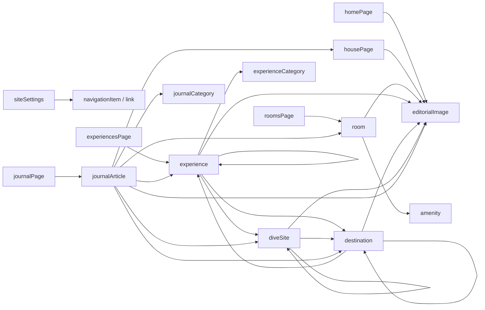

# Joshua's Point — Sanity Content Model

Status: Proposed for approval  
Scope: Content architecture only; no schemas or frontend integration

## Purpose

This document defines the content architecture for Joshua's Point before Sanity schemas are
implemented. The model is designed to keep content structured, reusable, accessible, and
independent from the current React component tree.

The CMS should describe the place and its stories. Layout, typography, responsive behavior, and
visual atmosphere remain responsibilities of the frontend and Design System.

## Modeling principles

1. **Use singleton documents for fixed pages and global settings.** Editors should never create a
   second homepage or settings document.
2. **Use repeatable documents for content with its own identity and URL.** Rooms, experiences, and
   journal articles are independent documents.
3. **Use objects for content that only exists as part of another document.** Images, galleries,
   links, SEO, quotes, and bed configurations do not need independent publishing lifecycles.
4. **Prefer named page sections over a generic page builder.** The approved editorial sequence is
   intentional and should not be rearranged accidentally.
5. **Reference shared content instead of copying it.** Landing pages curate room, experience, and
   article documents through ordered references.
6. **Keep presentation choices limited.** Crop, focal point, and intentionally supported media
   proportions are valid. Arbitrary colors, type sizes, and layout classes are not CMS content.
7. **Make accessibility part of the model.** Informative images require alternative text; video
   requires captions or a transcript; link labels must describe their destination.
8. **Keep Sanity types out of UI components.** A future query layer will map Sanity results into the
   stable frontend component properties documented in `ARCHITECTURE.md`.

## Naming conventions

- Schema names use `camelCase`, for example `siteSettings` and `editorialImage`.
- Public documents use a required, unique `slug` when they own a route.
- Singleton documents use fixed IDs and fixed frontend routes rather than editable slugs.
- Field names describe meaning, not layout: use `introduction`, not `leftColumnText`.
- Ordered arrays are authoritative. Frontend code should preserve their order.
- Every reusable array item keeps its Sanity `_key` for stable editing and rendering.

## Content type overview

### Singleton documents

| Schema type       | Route or scope | Purpose                                      |
| ----------------- | -------------- | -------------------------------------------- |
| `siteSettings`    | Global         | Identity, SEO defaults, contact, navigation  |
| `homePage`        | `/`            | Approved Homepage narrative                  |
| `housePage`       | `/the-house`   | House and architecture narrative             |
| `roomsPage`       | `/rooms`       | Accommodation introduction and room curation |
| `experiencesPage` | `/experiences` | Experience index and slow-travel narrative   |
| `journalPage`     | `/journal`     | Journal introduction and article curation    |

### Repeatable documents

| Schema type          | Route pattern          | Purpose                                   |
| -------------------- | ---------------------- | ----------------------------------------- |
| `room`               | `/rooms/[slug]`        | One accommodation and its editorial story |
| `amenity`            | Not public             | Reusable room amenity vocabulary          |
| `experience`         | `/experiences/[slug]`  | One activity or lived-experience story    |
| `experienceCategory` | Taxonomy               | Groups related experience stories         |
| `destination`        | `/destinations/[slug]` | Editorial guide to one place              |
| `diveSite`           | `/dive-sites/[slug]`   | Editorial guide to one dive site          |
| `journalArticle`     | `/journal/[slug]`      | Long-form editorial article               |
| `journalCategory`    | Taxonomy               | Groups journal articles                   |

## Common editorial fields

All public page and entry documents should include:

- `internalTitle` — required string used in Studio lists; may match the public title.
- `workflowStatus` — `draft`, `inReview`, or `approved`; see Publishing workflow.
- `seo` — shared `seo` object, with fallbacks from `siteSettings`.
- `lastReviewedAt` — optional datetime for content governance, not displayed publicly.

Repeatable public documents also include:

- `title` — required public title; `diveSite` uses the equivalent field `name`.
- `slug` — required, unique slug generated from the title and manually editable.
- `excerpt` — concise summary for cards, search results, and related content.

## 1. Site Settings

### Document: `siteSettings`

Singleton with the fixed ID `siteSettings`.

#### Identity

| Field             | Type   | Rules                                               |
| ----------------- | ------ | --------------------------------------------------- |
| `siteTitle`       | string | Required; default “Joshua's Point”                  |
| `siteUrl`         | URL    | Required in production; canonical HTTPS origin      |
| `siteDescription` | text   | Short factual description used as an editorial base |
| `defaultLocale`   | string | Default `en`; reserved for future localization      |

#### SEO defaults

| Field                | Type             | Rules                                         |
| -------------------- | ---------------- | --------------------------------------------- |
| `defaultSeo`         | `seo`            | Required fallback title and description       |
| `defaultSocialImage` | `editorialImage` | Required before launch; landscape composition |

Page-level SEO overrides these defaults. Missing page values fall back field by field, not by
replacing the entire object.

#### Contact details

Object `contactDetails`:

- `email` — valid email address.
- `phone` — human-readable phone number.
- `phoneHref` — normalized international `tel:` value.
- `address` — `postalAddress` object with locality, region, postal code, and country.
- `mapUrl` — optional external map destination.
- `inquiryNote` — optional short guidance for contacting the property.

Only publish contact channels that are actively monitored.

#### Property location

`propertyLocation` is a required `mapLocation` object containing the canonical coordinates and
label for Joshua's Point. It is the origin used for travel-time guidance, directions links, and
future regional maps. The location is stored once rather than copied into destination documents.

#### Primary navigation

`primaryNavigation` is an ordered array of `navigationItem` objects:

- `label` — concise visible label.
- `link` — shared `link` object.
- `openInNewTab` — allowed only for external destinations.

Navigation should remain deliberately small. The CMS controls labels, order, and destinations but
does not control Header layout or behavior.

#### Footer

Object `footer`:

- `introduction` — one short closing statement.
- `navigationGroups[]` — group title plus ordered `navigationItem[]`.
- `contactDetailsOverride` — optional; otherwise use global contact details.
- `socialLinks[]` — platform label and external URL.
- `legalLinks[]` — ordered `navigationItem[]`.
- `copyrightText` — text without a hardcoded year; the frontend may append the current year.

#### Booking links

Object `bookingLinks`:

- `primary` — required `link` object when booking is enabled.
- `inquiry` — optional contact or inquiry link.
- `enabled` — boolean allowing booking links to be hidden without deleting configuration.
- `disclosure` — optional short note when the destination is an external booking service.

Booking URLs live in one place. Individual pages reference the global booking intent rather than
copying external URLs.

## 2. Home Page

### Document: `homePage`

Singleton with the fixed ID `homePage` and route `/`.

The approved Homepage uses named objects in a fixed sequence:

#### `hero`

- `eyebrow`
- `heading`
- `introduction`
- `image` — `editorialImage`
- `primaryLink` — optional `link`
- `secondaryLink` — optional `link`

#### `placeStory`

- `eyebrow`
- `heading`
- `body` — short text; intentionally not unrestricted Portable Text
- `image` — `editorialImage`
- `caption`

#### `morningNarrative`

- `eyebrow`
- `heading`
- `body`
- `image` — `editorialImage`
- `caption` — optional

#### Page fields

- `seo`
- `workflowStatus`
- `lastReviewedAt`

Future Homepage sections should be added as explicitly designed named fields after approval. Do
not add a generic `sections[]` page builder preemptively.

## 3. The House

### Document: `housePage`

Singleton with the fixed ID `housePage` and route `/the-house`.

#### `hero`

- `eyebrow`
- `title`
- `introduction`

#### `editorialIntroduction`

- `heading`
- `body`

#### `panoramicPhotography`

- `image` — required `editorialImage`
- `caption` — required when the image needs context

#### `architectureStory`

- `eyebrow`
- `heading`
- `body`
- `image` — required `editorialImage`
- `caption`

#### `materials`

Ordered array of `materialStory` objects:

- `name` — for example Timber, Stone, Light, or Air.
- `description`
- `image` — optional and reserved for a future approved presentation.

Require one item and recommend no more than six. The current editorial direction uses four.

#### `finalReflection`

- `body` — one concise paragraph.

#### Page fields

- `seo`
- `workflowStatus`
- `lastReviewedAt`

## 4. Rooms

### Document: `roomsPage`

Singleton with the fixed ID `roomsPage` and route `/rooms`.

- `hero` — eyebrow, title, and introduction.
- `editorialIntroduction` — heading and body.
- `collectionIntroduction` — eyebrow and heading.
- `featuredRooms[]` — ordered, unique references to `room` documents.
- `imageBreak` — `editorialImage` plus caption.
- `comfortPhilosophy` — eyebrow, heading, and body.
- `closingReflection` — one paragraph.
- `seo`, `workflowStatus`, and `lastReviewedAt`.

The page controls curation and order. Room facts remain on each referenced `room` document.

### Document: `room`

#### Identity and preview

| Field          | Type             | Rules                               |
| -------------- | ---------------- | ----------------------------------- |
| `title`        | string           | Required                            |
| `slug`         | slug             | Required and unique                 |
| `excerpt`      | text             | Required; concise editorial summary |
| `previewImage` | `editorialImage` | Used on `/rooms`                    |

#### Description and story

- `hero` — title override, eyebrow, introduction, and hero image.
- `description` — short plain-text room description.
- `editorialContent` — `portableText` for the individual room page.
- `gallery` — shared `gallery` object.
- `closingReflection` — optional short paragraph.

#### Capacity

Object `capacity`:

- `maxGuests` — required integer greater than zero.
- `adults` — optional integer when operationally useful.
- `children` — optional integer when operationally useful.
- `displayLabel` — optional editorial label such as “Two guests”; frontend falls back to
  `maxGuests`.

Do not store availability or pricing in this document.

#### Beds

`beds[]` is an array of `bedConfiguration` objects:

- `type` — controlled value such as king, queen, double, single, bunk, or sofa bed.
- `quantity` — positive integer.
- `roomLabel` — optional location such as “Main bedroom”.
- `notes` — optional operational clarification, not promotional copy.

#### Amenities

`amenities[]` is an ordered array of `roomAmenity` objects:

- `amenity` — reference to an `amenity` document.
- `note` — optional room-specific clarification.

### Document: `amenity`

Non-public reference document:

- `name` — required, unique label.
- `category` — controlled value such as sleep, bathing, climate, connectivity, or accessibility.
- `description` — optional factual explanation.
- `internalKey` — stable unique identifier for integrations.
- `active` — hides retired amenities from new selections without breaking existing references.

Amenities do not contain icons. Iconography remains a frontend design decision if approved later.

#### Room SEO and governance

- `seo`
- `workflowStatus`
- `lastReviewedAt`

## 5. Experiences

### Document: `experiencesPage`

Singleton with the fixed ID `experiencesPage` and route `/experiences`.

- `hero` — eyebrow, title, and introduction.
- `whyThisPlace` — eyebrow, heading, and body.
- `featuredIntroduction` — eyebrow and heading.
- `featuredExperiences[]` — ordered, unique references to `experience` documents; currently four.
- `imageBreak` — `editorialImage` plus caption.
- `slowTravel` — eyebrow, heading, and body.
- `closingReflection` — one paragraph.
- `seo`, `workflowStatus`, and `lastReviewedAt`.

### Document: `experience`

#### Identity and preview

- `title` — required.
- `slug` — required and unique.
- `excerpt` — required short editorial description.
- `category` — reference to one `experienceCategory`.
- `previewImage` — required `editorialImage` before publication.

#### Editorial entry

- `heroImage` — required `editorialImage`; may reuse the preview asset with a different crop.
- `introduction` — short text.
- `editorialContent` — `portableText` for the full narrative.
- `gallery` — optional `gallery`.
- `locationLabel` — optional human-readable place name.
- `mapLocation` — optional shared `mapLocation` when the experience belongs to a specific place.
- `relatedExperiences[]` — up to four unique references to other `experience` documents; prevent
  self-reference.
- `relatedDestinations[]` — optional unique references to relevant `destination` documents.
- `relatedDiveSites[]` — optional unique references when diving is part of the experience.

Avoid reducing experiences to durations, ratings, or checklist-style attractions. Operational
details should only be added later when a real visitor need is established.

#### Experience SEO and governance

- `seo`
- `workflowStatus`
- `lastReviewedAt`

### Document: `experienceCategory`

- `title` — required and unique.
- `slug` — required and unique.
- `description` — optional internal/editorial context.
- `seo` — required only if category archive pages are introduced.

Initial examples might include Sea, Mountains, Islands, Forest, Community, and At Joshua's Point.
Taxonomy should remain small and useful.

## 6. Destinations

### Document: `destination`

Route: `/destinations/[slug]`.

Destinations are editorial guides to places guests can explore from Joshua's Point. Initial
subjects may include Casaroro Falls, Lake Balanan, Danjugan Island, Sipalay, Bayawan, Twin Lakes,
local markets, scenic viewpoints, coffee stops, beaches, and waterfalls.

#### Identity and preview

- `internalTitle` — required Studio title.
- `title` — required public destination name.
- `slug` — required and unique.
- `excerpt` — required concise journal-style summary for listings and related content.
- `heroImage` — required `editorialImage` before publication.
- `gallery` — optional `gallery`.

#### Editorial story

- `editorialIntroduction` — required short introduction establishing the character of the place.
- `story` — required `portableText`; the main travel-journal narrative.
- `whyVisit` — concise text explaining what makes the place worth time and attention without sales
  language.
- `highlights[]` — ordered short editorial observations, not feature cards or a checklist of claims.

#### Practical guidance

- `travelTimeFromJoshuaPoint` — required `travelTime` object with an approximate duration and
  human-readable label.
- `recommendedTransport[]` — controlled transport values such as scooter, car, hired driver, boat,
  walking, or public transport; finalize the vocabulary before schema implementation.
- `scooterFriendly` — required boolean before publication.
- `mapLocation` — required provider-neutral `mapLocation` with coordinates.
- `interactiveMapEnabled` — boolean controlling whether an interactive map may be offered in
  addition to the accessible fallback.
- `difficulty` — controlled value such as easy, moderate, or demanding, defined from the visitor's
  perspective.
- `bestTimeToVisit` — concise seasonal or time-of-day guidance.
- `entranceFee` — optional `feeInformation`; factual and reviewed regularly.
- `openingHours` — optional `openingInformation`; never imply that third-party hours are guaranteed.
- `thingsToBring[]` — ordered short practical items.
- `tips[]` — ordered concise editorial tips.

Travel time, fees, access, and hours are changeable facts. They require a recent `lastReviewedAt`
date and should be presented as guidance rather than guarantees.

#### Relationships

- `relatedDestinations[]` — up to four unique destination references; prevent self-reference.
- `relatedExperiences[]` — optional unique references to relevant `experience` documents.
- Nearby dive-site relationships are owned by `diveSite.nearbyDestinations`; the frontend may
  resolve incoming references rather than duplicate them here.

#### Destination SEO and governance

- `seo`
- `workflowStatus`
- `lastReviewedAt`

## 7. Dive Sites

### Document: `diveSite`

Route: `/dive-sites/[slug]`.

Dive sites are editorial field guides for diving around Dumaguete, Dauin, Zamboanguita, Siaton,
and other verified locations. A region name may organize several individual dive sites, but each
published document should describe one clear mappable subject.

#### Identity and preview

- `internalTitle` — required Studio title.
- `name` — required public dive-site name.
- `slug` — required and unique.
- `excerpt` — required concise summary for listings and related content.
- `heroImage` — required `editorialImage` before publication.
- `gallery` — optional `gallery`.

#### Editorial guide

- `description` — required `portableText` describing the site and the experience of diving it.
- `marineLife[]` — ordered factual names or concise observations; avoid promising sightings.
- `photographyNotes` — optional practical and editorial guidance for underwater photography.
- `safetyNotes` — required factual guidance reviewed by a qualified local source.

#### Dive conditions

- `diveLevel` — required controlled value: beginner, intermediate, or advanced.
- `maximumDepthMeters` — required positive number.
- `averageDepthMeters` — optional positive number that cannot exceed maximum depth.
- `visibility` — `visibilityRange` with optional minimum, maximum, and contextual notes.
- `current` — controlled value such as calm, moderate, strong, or variable.
- `entryType` — controlled value such as shore, boat, or mixed.
- `mapLocation` — required provider-neutral `mapLocation` with GPS coordinates.
- `interactiveMapEnabled` — boolean controlling enhanced map presentation.
- `bestSeason` — concise seasonal guidance, acknowledging natural variability.

Conditions are observations, not guarantees. Depth, visibility, current, season, and safety fields
must show metric units explicitly and require factual review.

#### Relationships

- `relatedDiveSites[]` — up to four unique dive-site references; prevent self-reference.
- `nearbyDestinations[]` — optional unique references to `destination` documents.
- Related experience and journal content can reference this dive site without duplicating those
  relationships here.

#### Dive-site SEO and governance

- `seo`
- `workflowStatus`
- `lastReviewedAt`

## 8. Journal

### Document: `journalPage`

Singleton with the fixed ID `journalPage` and route `/journal`.

- `hero` — eyebrow, title, and introduction.
- `featuredArticle` — optional reference to one `journalArticle`.
- `featuredArticles[]` — ordered, unique references for curated secondary stories.
- `introduction` — optional short editorial statement.
- `seo`, `workflowStatus`, and `lastReviewedAt`.

Articles not explicitly featured can be listed by `publishedAt` descending.

### Document: `journalArticle`

#### Identity and preview

- `title` — required.
- `slug` — required and unique.
- `eyebrow` — optional short editorial label.
- `standfirst` — short introductory paragraph.
- `excerpt` — concise listing and SEO fallback text.
- `heroImage` — required `editorialImage` before publication.
- `category` — optional reference to one `journalCategory`.
- `publishedAt` — editorial publication datetime; required before publishing.
- `byline` — optional string; omit when the Joshua's Point voice is implied.

#### Article body

- `body` — required `portableText`.
- `gallery` — optional `gallery` when a separate gallery belongs to the article.
- `relatedArticles[]` — up to four unique references; prevent self-reference.
- `relatedExperiences[]` — optional references to relevant `experience` documents.
- `relatedDestinations[]` — optional references to relevant `destination` documents.
- `relatedDiveSites[]` — optional references to relevant `diveSite` documents.
- `relatedRooms[]` — optional references to relevant `room` documents.
- `relatedHouse` — optional reference to the `housePage` singleton when architecture is central to
  the article.

#### Article SEO and governance

- `seo`
- `workflowStatus`
- `lastReviewedAt`

### Document: `journalCategory`

- `title` — required and unique.
- `slug` — required and unique.
- `description` — optional.
- `seo` — required only if public category routes are introduced.

Keep categories broad enough to remain useful, such as Architecture, Landscape, People, Food, and
Field Notes.

## 9. Shared Objects

### Object: `editorialImage`

- `asset` — required Sanity image asset with hotspot and crop enabled.
- `alt` — required for informative images.
- `decorative` — boolean; when true, `alt` must be empty and the frontend must hide the image from
  assistive technology.
- `caption` — optional contextual caption.
- `credit` — optional photographer or source credit.
- `creditUrl` — optional URL paired with credit.
- Low-quality image placeholder data is derived from Sanity asset metadata at query time; it is not
  a schema field and editors never enter it.

Validation must require either meaningful `alt` text or an explicit decorative choice, never
neither. Alternative text describes the image; captions explain why it matters.

### Object: `seo`

- `metaTitle` — optional page override; preview recommended search length in Studio.
- `metaDescription` — optional page override; preview recommended search length in Studio.
- `socialTitle` — optional social override.
- `socialDescription` — optional social override.
- `socialImage` — optional `editorialImage`, falling back to site defaults.
- `noIndex` — boolean, default false.
- `canonicalUrl` — optional absolute URL for genuinely duplicated content only.

The frontend fallback order is page override → document title/excerpt → `siteSettings.defaultSeo`.

### Object: `link`

- `kind` — `internal`, `external`, `email`, or `phone`.
- `label` — required, descriptive text.
- `reference` — required for internal links; accepts supported page and entry documents.
- `externalUrl` — required for external links.
- `email` or `phone` — required for their respective kinds.
- `openInNewTab` — external links only.

Validation should enforce only the fields relevant to the selected kind. Internal URLs are derived
from the referenced document type and slug, not typed manually.

### Object: `button`

- `link` — required shared `link`.
- `style` — controlled semantic intent: `primary`, `secondary`, or `quiet`.
- `accessibilityLabel` — optional when the visible label lacks sufficient context.

Buttons are content only when an approved component supports them. Editors cannot invent visual
styles.

### Object: `quote`

- `text` — required plain text.
- `attribution` — optional.
- `context` — optional short source or location.
- `style` — optional controlled value for supported editorial scales, not arbitrary formatting.

### Object: `gallery`

- `images[]` — required ordered array of at least two `editorialImage` objects.
- `caption` — optional caption for the collection.
- `accessibleLabel` — required concise description of the gallery's subject.

Gallery layout is selected by the frontend context. Do not store column counts or CSS concepts.

### Object: `video`

- `sourceType` — `file` or `external`.
- `file` — Sanity file asset when source type is file.
- `externalUrl` — supported video URL when source type is external.
- `posterImage` — required `editorialImage`.
- `title` — required accessible title.
- `caption` — optional visible context.
- `transcript` — required when meaningful speech or sound conveys information.
- `autoplay` — not editor-controlled; the frontend follows the motion and accessibility rules.

### Object: `portableText`

Supported blocks:

- Normal paragraph, H2, and H3.
- Blockquote.
- Bulleted and numbered lists when editorially necessary.
- Strong and emphasis marks used sparingly.
- Internal and external link annotations using the shared link rules.
- Embedded `editorialImage`, `gallery`, `quote`, and `video` objects.

Do not expose arbitrary colors, font sizes, alignment, raw HTML, or layout controls.

### Supporting objects

- `navigationItem` — label plus `link`.
- `navigationGroup` — title plus ordered items.
- `socialLink` — platform label plus URL.
- `postalAddress` — structured address fields.
- `pageHero` — eyebrow, title, introduction, and optional image when shared by interior pages.
- `editorialIntroduction` — optional heading plus concise body.
- `imageBreak` — `editorialImage` plus caption.
- `materialStory` — name, description, and optional image.
- `bedConfiguration` — bed type, quantity, room label, and notes.
- `roomAmenity` — amenity reference plus room-specific note.
- `mapLocation` — required geographic point, human-readable label, and optional external directions
  URL. Coordinates are provider-neutral even when the directions URL uses Google Maps.
- `travelTime` — approximate duration in minutes plus the editorial display label used on the site.
- `feeInformation` — non-negative amount, ISO currency code, and optional factual notes.
- `openingInformation` — concise human-readable hours and optional qualification for seasonal or
  irregular access.
- `visibilityRange` — optional minimum and maximum visibility in meters plus contextual notes.

Objects should only become documents when they need independent ownership, reuse, permissions, or
publishing.

## 10. Editorial Travel Guide Philosophy

Joshua's Point is not building a tourism brochure or an attractions database. Destination and
dive-site pages should read like carefully edited travel-journal entries written by people who pay
attention to the place.

The guide should:

- Help guests discover southern Negros slowly and independently.
- Describe atmosphere, landscape, communities, and the journey between places—not just arrival.
- Prefer first-hand observation and locally verified knowledge over copied destination summaries.
- Make practical guidance clear without allowing facts to overwhelm the story.
- Avoid superlatives, rankings, bucket-list language, and promises about wildlife or conditions.
- Name local communities and businesses accurately and respectfully.
- Distinguish observation from advice, and advice from safety-critical information.
- Encourage enough time, responsible access, and sensitivity to weather, ecology, and local life.

Each page should leave the reader with a sense of how a place feels, why it matters, and what they
need to know to visit thoughtfully. The ambition is for Joshua's Point to become the most useful
and carefully written guide to exploring southern Negros while remaining recognizably a host's
perspective, not a commercial directory.

## 11. Map Strategy

### Provider-neutral content

Sanity stores location facts, not map-provider implementation details. Every published
`destination` and `diveSite` requires a `mapLocation` with:

- `coordinates` — Sanity `geopoint` containing latitude and longitude.
- `label` — accessible human-readable place name.
- `directionsUrl` — optional external directions link.

`siteSettings.propertyLocation` stores the Joshua's Point origin. Travel time is editorially
reviewed and stored separately because road, ferry, and weather conditions make calculated times
variable.

Do not store API keys, map style IDs, or provider secrets in Sanity. Those belong in deployment
environment variables.

### Google Maps or Mapbox

The frontend should eventually expose one provider adapter with implementations for Google Maps or
Mapbox. Both consume the same normalized coordinates and labels, so changing providers does not
require migrating destination content.

Provider choice is a technical configuration, not an editor-controlled field. Before selecting a
provider, compare:

- Coverage and directions quality in southern Negros.
- Cost and usage limits.
- Custom styling and marker accessibility.
- Privacy, consent, and third-party script behavior.
- Static-image and server-rendering options.
- Support for multiple destinations, dive sites, and route origins.

### Map presentation

- `interactiveMapEnabled` permits enhanced map presentation but never replaces text directions or
  the external directions link.
- Prefer a static or lightweight preview before loading a full interactive map.
- Load third-party map JavaScript only where needed and, when appropriate, only after user intent.
- Every map needs a visible location name, keyboard-accessible controls, and a non-map fallback.
- Markers must distinguish destinations and dive sites without relying on color alone.
- Coordinate precision should be reviewed. Sensitive ecological or community locations may use a
  safe public meeting point rather than exact access coordinates.
- A future regional map may query both document types and render them through one normalized view
  model.

### Accuracy and safety

Editors must verify coordinates against a trusted local source before publication. Dive-site
coordinates and safety notes require qualified review. Maps support orientation; they do not
replace local conditions, guide instructions, or professional dive planning.

## 12. Relationships

### Relationship rules

- `roomsPage.featuredRooms` owns room order on `/rooms`; a room does not store its landing-page
  position.
- `experiencesPage.featuredExperiences` owns curation and order on `/experiences`.
- `destination.relatedDestinations` and `diveSite.relatedDiveSites` provide small, manually curated
  continuations; neither may reference itself.
- `destination.relatedExperiences` connects a place to a broader narrative or activity without
  duplicating the experience content.
- `experience.relatedDestinations` and `experience.relatedDiveSites` identify the places an
  experience depends on. These are curated links, not automatic tags.
- `diveSite.nearbyDestinations` connects diving with relevant on-land regional context.
- `journalPage` owns featured placement; the general journal list uses publication date.
- `journalArticle` is the primary connective editorial document: it may relate to destinations,
  dive sites, experiences, rooms, and the House when the story genuinely spans them.
- `room` and `housePage` remain the place of origin rather than generic recommendation containers.
  Their connection to the regional guide is normally expressed through travel time from Joshua's
  Point, internal links, and related journal stories. Add curated guide fields to those documents
  only after a corresponding frontend section is designed and approved.
- Related-entry arrays are manually curated, unique, limited, and cannot reference their own
  document.
- Core curated references should be strong references so content cannot be deleted while actively
  used. Optional related-content references may be weak only if graceful removal is implemented.
- Categories are referenced documents, not free-text tags, preventing spelling variants and
  duplicate archives.
- Internal links reference documents. A single route resolver maps document type and slug to a
  public URL.
- Cross-references do not imply reciprocal relationships. If an experience references another,
  the second document is not automatically edited.

### Deletion and unpublishing

Before unpublishing a room, experience, destination, dive site, or article:

1. Check incoming references in landing pages, navigation, and related content.
2. Remove or replace curated references.
3. Define redirect behavior for any previously public slug.
4. Confirm that cached frontend routes will be revalidated when integration exists.

Redirect modeling should be added when real URL changes begin; it is not needed before public
content exists.

## 13. Publishing Workflow

Sanity's draft and published document states remain the source of truth. `workflowStatus` supports
the human review step without pretending that a reviewed draft is public.

### Draft

- Create or edit the Sanity draft.
- Keep `workflowStatus` as `draft`.
- Complete required fields and resolve validation errors.
- Use honest, observational language that follows `docs/design-system/08-writing-style.md`.
- Add alternative text, captions, credits, and transcripts where required.
- Preview at mobile and desktop widths once frontend preview is available.

### Review

- Set `workflowStatus` to `inReview` while the document remains a draft.
- Reviewer checks factual accuracy, voice, grammar, links, image rights, crop, accessibility, and
  SEO previews.
- For destinations, reviewer verifies travel time, transport, scooter suitability, coordinates,
  access, fees, opening hours, and practical guidance against a current local source.
- For dive sites, a qualified reviewer verifies coordinates, depth, visibility context, current,
  entry type, season, marine-life wording, and safety notes.
- Reviewer verifies references and confirms that related content is already published or scheduled.
- Requested edits return the status to `draft`.
- Accepted work moves to `approved`.

### Published

- Only an `approved` draft should be published.
- Publishing creates or updates the public Sanity document.
- A future webhook should revalidate the affected route plus any landing pages that reference it.
- Record `publishedAt` for journal articles; do not rewrite the original date for minor corrections.
- Set `lastReviewedAt` after material factual review.
- Re-review volatile destination and dive-site facts on a defined schedule even when the narrative
  has not changed.

### Recommended roles

- **Editor:** creates and revises drafts.
- **Reviewer:** approves voice, facts, accessibility, and image use.
- **Publisher:** publishes approved documents and verifies the live result.

One person may hold multiple roles initially, but the steps should remain distinct.

### Publication checklist

- Required fields pass validation.
- Slug is correct and unique.
- No draft-only referenced content is required by the page.
- Images have alt text or are explicitly decorative.
- Links resolve and external destinations are intentional.
- SEO title, description, and social image have valid fallbacks.
- Copy avoids unsupported claims and marketing clichés.
- Coordinates have been checked and the non-map fallback is meaningful.
- Travel, access, fee, opening-hour, dive-condition, and safety details have a current factual
  review.
- Preview matches the approved editorial structure.

## 14. Future Extensions

Future schemas should follow the same document/object rules and only be introduced when the content
and publishing owner are clear.

### Guest Guide

Potential documents:

- `guestGuide` singleton for introduction and emergency/contact information.
- `guideSection` or `guideEntry` documents for arrival, house use, local services, and departure.

This content may require authenticated or unlisted delivery. Public/private access must be designed
before schema implementation.

### Recipes

Potential `recipe` document:

- Title, slug, introduction, hero image, ingredients, method, yield, source or contributor, season,
  related journal articles, and SEO.

Use structured ingredients and steps only if recipe functionality is genuinely planned.

### Travel Tips

Start as tips within a `destination`, as Journal content, or as a dedicated Journal category.
Create a separate `travelTip` document only when tips need independent routes, ownership, or a
publishing lifecycle.

### Seasonal Stories

Prefer `journalArticle` with a season taxonomy or curated seasonal collection. Create a separate
document type only if seasonal stories gain distinct fields or publishing behavior.

### Other likely extensions

- Redirect records when public slugs change.
- Localization when an editorial translation workflow exists.
- Scheduled publishing when the content calendar requires it.
- Private guest content with explicit authentication and authorization.
- Structured people or contributor documents if bylines become frequent.

## Schema implementation recommendations

Before writing schemas:

1. Approve the document and object inventory in this file.
2. Confirm the final room names, capacity language, bed vocabulary, and amenity taxonomy.
3. Confirm the destination transport vocabulary, difficulty definitions, fee representation, and
   factual review cadence.
4. Confirm dive-level, current, entry-type, depth, and visibility vocabularies with a qualified
   local dive professional.
5. Verify the canonical Joshua's Point coordinates and decide which sensitive locations require a
   safer public meeting point.
6. Evaluate Google Maps and Mapbox against local coverage, accessibility, privacy, and cost before
   choosing a provider.
7. Decide whether `/destinations` and `/dive-sites` are generated indexes or require curated
   singleton landing-page documents before their entry schemas are implemented.
8. Confirm which page links are editorial and which booking links are operational.
9. Decide who can review and publish in Sanity, including who owns travel and dive safety review.
10. Define singleton behavior and Studio desk structure.
11. Define route resolution for every referenceable document type.
12. Define preview URLs, draft-mode access, and environment variables.
13. Define query projections that return frontend-safe view models rather than raw documents.
14. Define webhook-driven revalidation and reference-aware cache invalidation.
15. Add schema validation, initial values, previews, field groups, and helpful descriptions as part
    of implementation—not as a later cleanup pass.

The initial schema implementation should remain focused. Build the approved core types first,
populate representative content, test the editing workflow, and only then add future extensions.
