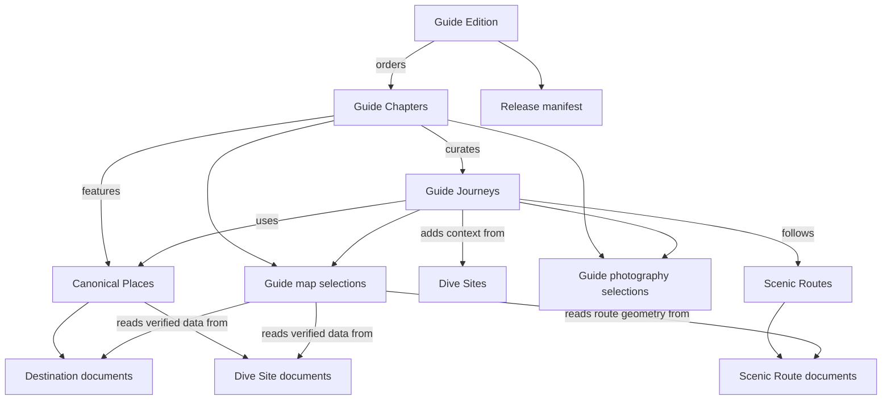

# Joshua's Point — Southern Negros Premium Guide Content Model

## Status and scope

This document proposes the Sanity content architecture for Edition 1 of the Southern Negros
premium guide. It uses:

- `SOUTHERN_NEGROS_ORIENTAL_GUIDE_SCOPE.md`
- `SOUTHERN_NEGROS_PREMIUM_GUIDE_PRODUCT_DEFINITION.md`
- `SOUTHERN_NEGROS_PREMIUM_GUIDE_EDITORIAL_BLUEPRINT.md`

It does not implement schemas, migrate content, build frontend routes, create checkout, or generate
the final PDF.

## Core recommendation

Build the premium guide as a **reference-led publication layer** over the existing Joshua's Point
content system.

Keep these canonical:

- Places and practical place facts in `destination`.
- Scenic route paths, stops, and route guidance in `scenicRoute`.
- Dive facts and specialist-reviewed guidance in `diveSite`.
- Images through the existing `editorialImage` and `gallery` objects.
- Coordinates through `mapLocation` and route geometry.
- Relationships through the existing Relationship Engine.

Add only three new documents:

1. `guideEdition`
2. `guideChapter`
3. `guideJourney`

Add a small set of guide-specific objects for recommendations, itinerary sections, photography
roles, map selections, planning notes, source provenance, and release records.

Do **not** create a second `place`, `route`, `dive`, `image`, or coordinate model. Do not create a
generic page builder.

---

## 1. Content architecture principles

### 1. Canonical facts have one owner

A title, location, travel fact, route path, dive condition, or public image caption should not be
copied into several guide documents. Premium documents reference the canonical source and add only
edition-specific context.

### 2. The premium layer owns synthesis

The paid product owns the elements that make separate public pages useful as one publication:

- Selection.
- Sequence.
- Tobias's journey-specific recommendation.
- Itinerary shape.
- Comparative planning advice.
- Offline map selection.
- Chapter and edition structure.

### 3. Publication structure is explicit

Editors work with named documents and controlled objects. They do not assemble arbitrary blocks
into an undefined page.

### 4. Editions are reproducible

A released Edition 1 must remain reconstructable after canonical destination pages change. The
release process therefore records the exact document revisions and generated files used for the
edition.

### 5. Essential corrections remain public

Known closures, safety corrections, conservation restrictions, and material access changes remain
on public canonical pages. The premium edition links back to those pages and records its own review
date.

### 6. Internal provenance stays internal

Legacy source notes, private owner context, verification notes, reviewer details, and migration
decisions must never appear in public queries or PDF output unless explicitly approved.

---

## 2. Model relationship

The guide documents point toward canonical content. Canonical content does not need reciprocal
premium-guide fields. Incoming references can be resolved through GROQ and the Relationship Engine.

---

## 3. Existing models to reuse

### `destination`

### Continues to own

- Public place title and slug.
- Destination type.
- Excerpt and editorial introduction.
- Place story and why-visit content.
- Travel information.
- Things to bring and public tips.
- Verified map location.
- Gallery and photography notes.
- Related destinations.
- SEO, workflow status, and last-reviewed date.

### Premium use

Journeys and chapters reference `destination` for places such as Casaroro Falls, Lake Balanan,
Malatapay Market, Pulangbato Falls, Tambobo Bay, and regional hubs. The premium layer adds a reason
the place belongs in a particular day; it does not duplicate the place profile.

### `scenicRoute`

### Continues to own

- Route title and excerpt.
- Route story.
- Ordered route stops.
- Verified route geometry.
- Travel-time and scooter guidance where approved.
- Safety and alternative guidance.
- Related destinations.
- Photography notes.
- SEO, workflow status, and last-reviewed date.

### Premium use

`guideJourney` may reference one primary scenic route and draw its verified path and stops into an
offline map. The premium journey adds Tobias's day-level sequencing, pauses, and selection context.

### `diveSite`

### Continues to own

- Dive area or site identity.
- Editorial description.
- Marine-life observations.
- Specialist-reviewed conditions and safety notes.
- Verified public map location.
- Nearby destinations and related dive sites.
- Photography.
- SEO, workflow status, and last-reviewed date.

### Premium use

Journeys and chapters reference `diveSite` for editorial context. They must not copy depths,
currents, visibility, conditions, level, or technical coordinates into premium-only fields.

### `editorialImage`

Reuse for every guide photograph. It already owns:

- Asset and hotspot.
- Alternative text.
- Decorative status.
- Authoritative caption for that placement.
- Credit and credit URL.

The guide may add placement purpose and production status around an `editorialImage`, but it must
not introduce a second caption field.

### `gallery`

Reuse for ordered editorial image sequences. A gallery remains a considered sequence rather than a
media library.

### `mapLocation`

Reuse verified provider-neutral coordinates, label, and directions URL. Premium guide records do
not own coordinates.

### `routeStop`

Reuse scenic-route stops. If an itinerary needs a mappable stop that does not exist canonically,
editors must add it to the relevant route or create an appropriate canonical destination before
placing it on a premium map.

### `portableText`

Reuse for editorial chapter and journey narrative. Keep the existing restrained block set rather
than introducing arbitrary layout components into content.

### Shared governance objects and fields

Reuse:

- `seo` where a document has a public web representation.
- `workflowStatus`.
- `lastReviewedAt`.
- `internalTitle`.
- Existing editorial previews and non-blocking warnings.
- Existing relationship projections and route resolution.

---

## 4. New document types required

### 4.1 `guideEdition`

#### Purpose

Represents one governed, reproducible product edition. It owns the edition identity, ordered table
of contents, release state, cover, format intentions, and release record.

#### Proposed groups

- Identity
- Editorial Scope
- Contents
- Formats and Release
- SEO
- Governance

#### Proposed fields

| Field | Type | Requirement | Editorial purpose |
| --- | --- | --- | --- |
| `internalTitle` | Existing common field | Required | Studio working identity |
| `title` | String | Required | Public edition title |
| `subtitle` | String | Optional | Restrained edition descriptor |
| `slug` | Slug | Required | Stable public product/sample route if later enabled |
| `editionNumber` | String | Required | Semantic edition identifier such as `1.0` |
| `editionStatus` | Controlled string | Required | Planning, in production, release candidate, released, or superseded |
| `scopeStatement` | Text | Required | Short statement of geography and product boundary |
| `editorialIntroduction` | Portable Text | Required before release | Edition-level introduction, not destination copy |
| `coverImage` | `editorialImage` | Required before release | Approved cover photography |
| `chapters` | Ordered unique references to `guideChapter` | Required before release | Authoritative table-of-contents order |
| `mapPack` | Array of `guideMapSelection` | Required before release | Edition-level and area map selection |
| `plannedFormats` | Controlled array | Required | PDF, map pack, and conditional EPUB intentions |
| `publicationDate` | Date | Required when released | Visible edition publication date |
| `correctionsUrl` | HTTPS URL | Required before release | Public source for corrections and changing details |
| `supportUrl` | HTTPS URL | Required before sale | Product support path |
| `licenseSummary` | Text | Required before release | Approved personal-use summary |
| `updateEntitlementSummary` | Text | Required before sale | Exact approved update promise; never “lifetime” by default |
| `releaseManifest` | `guideReleaseManifest` | Generated at release | Document revisions, file checksums, and output record |
| `seo` | Existing `seo` | Optional until public product page | Search and sharing metadata |
| `workflowStatus` | Existing common field | Required | Editorial workflow independent of publishing |
| `lastReviewedAt` | Existing common field | Required before release | Material edition review date |

#### Validation

- `editionNumber` must be unique.
- Chapter references must be unique and ordered.
- A released edition requires cover, chapters, map pack, publication date, corrections URL,
  support URL, license, update entitlement, and release manifest.
- `workflowStatus` must be `approved` before `editionStatus` may be `released`.
- Released editions become editorially immutable; changes create a new semantic version.
- No secure download URL or provider credential belongs in this document.

#### Preview

- Title: edition title plus edition number.
- Subtitle: edition status, workflow status, and last-reviewed date.
- Media: cover image.

### 4.2 `guideChapter`

#### Purpose

Represents one explicit Edition 1 chapter. It owns chapter-level narrative and selection, not
canonical place facts.

#### Proposed groups

- Identity
- Editorial Narrative
- Curated Content
- Photography and Maps
- Sources
- Governance

#### Proposed fields

| Field | Type | Requirement | Editorial purpose |
| --- | --- | --- | --- |
| `internalTitle` | Existing common field | Required | Studio working identity |
| `title` | String | Required | Public chapter title |
| `shortTitle` | String | Optional | Running header and compact navigation label |
| `eyebrow` | String | Optional | Restrained chapter context |
| `purpose` | Text | Required, Studio-only | Approved job of the chapter from the blueprint |
| `introduction` | Portable Text | Required | Chapter opening in Tobias's voice |
| `body` | Portable Text | Optional | Chapter-specific editorial context that is not a journey or place profile |
| `journeys` | Ordered unique references to `guideJourney` | Optional | Premium journey sequence |
| `featuredPlaces` | Ordered `guidePlaceSelection` array | Optional | Canonical places included without copied facts |
| `recommendations` | Array of `guideRecommendation` | Optional | Chapter-specific owner recommendations |
| `planningNotes` | Array of `guidePlanningNote` | Optional | Premium-only preparation and comparison guidance |
| `photography` | Array of `guidePhotographySelection` | Optional during drafting; required by chapter brief before release | Controlled visual sequence |
| `maps` | Array of `guideMapSelection` | Optional during drafting; required where blueprint specifies a map | Canonical-data map selection |
| `closingReflection` | Portable Text | Optional | Quiet chapter close |
| `sources` | Array of `guideSourceReference` | Required before review | Internal provenance |
| `workflowStatus` | Existing common field | Required | Editorial workflow |
| `lastReviewedAt` | Existing common field | Required before release | Factual review date |

#### Validation

- Journeys and featured places must be unique within the chapter.
- A chapter may contain no copied map coordinates.
- At least one source reference is required before `inReview`.
- A chapter cannot become approved while referenced journeys are drafts or materially stale.
- Maps required by the editorial blueprint must have an accessible summary.
- Public output excludes `purpose`, sources, verification notes, and internal placement notes.

#### Ordering

Chapter order belongs only to `guideEdition.chapters`. Do not store an independent chapter number
that can drift from the edition.

### 4.3 `guideJourney`

#### Purpose

Represents the premium product's core value: one curated day or meaningful sequence from Joshua's
Point. It connects canonical places and routes with Tobias's recommendation, itinerary, preparation,
alternatives, maps, and photography.

#### Proposed groups

- Identity
- Recommendation
- Itinerary
- Planning
- Places and Relationships
- Photography and Maps
- Sources
- Governance

#### Proposed fields

| Field | Type | Requirement | Editorial purpose |
| --- | --- | --- | --- |
| `internalTitle` | Existing common field | Required | Studio working identity |
| `title` | String | Required | Guest-facing journey title |
| `slug` | Slug | Required | Stable internal/export identifier; future public sample path if approved |
| `overview` | Text | Required | Concise distinction from other journeys |
| `primaryRecommendation` | `guideRecommendation` | Required | Why Tobias recommends this journey |
| `experienceNarrative` | Portable Text | Required | Observed journey story and character |
| `itinerary` | Ordered array of `guideItinerarySection` | Required | Premium day sequence |
| `timeNeeded` | Existing `travelTime` | Optional until verified | Reviewed day-shape timing |
| `paceAndSuitability` | Portable Text | Optional | Observed effort and individual-assessment context |
| `thingsToBring` | Array of strings | Optional | Journey-specific preparation only |
| `thingsToConfirm` | Array of `guidePlanningNote` | Optional | Changeable details requiring current confirmation |
| `combineWith` | Ordered array of `guidePlaceSelection` | Optional | Places that naturally fit the same day |
| `shorterAlternative` | Portable Text | Optional | Approved quieter or shorter option |
| `primaryRoute` | Reference to `scenicRoute` | Optional | Canonical route path and stops |
| `relatedPlaces` | Ordered `guidePlaceSelection` array | Required | Canonical destination/dive references |
| `photography` | Array of `guidePhotographySelection` | Required by journey brief before release | Journey image sequence |
| `maps` | Array of `guideMapSelection` | Required before release | Journey and route map selection |
| `returnReflection` | Portable Text | Optional | Quiet return to Joshua's Point |
| `sources` | Array of `guideSourceReference` | Required before review | Internal source provenance |
| `workflowStatus` | Existing common field | Required | Editorial workflow |
| `lastReviewedAt` | Existing common field | Required before release | Material fact review date |

#### Validation

- Itinerary order is the authoritative journey sequence.
- `relatedPlaces`, `combineWith`, and itinerary references must not repeat accidentally.
- A journey with a scenic route reads path and stop data from `scenicRoute`; it does not copy them.
- `timeNeeded` remains empty until a source and review date exist.
- `primaryRecommendation.sourceType` must identify Tobias when presented as his recommendation.
- Dive-related journeys cannot be approved while specialist-dependent claims lack reviewer status.
- Maps cannot contain private Joshua's Point coordinates or unreviewed technical dive coordinates.

#### Preview

- Title: public journey title.
- Subtitle: primary area, workflow status, and last-reviewed date.
- Media: opening photography selection when available.

---

## 5. New object types required

### 5.1 `guidePlaceSelection`

#### Purpose

Places an existing canonical destination or dive site into a chapter or journey with a
premium-specific editorial role.

#### Fields

| Field | Type | Requirement | Notes |
| --- | --- | --- | --- |
| `place` | Reference to `destination` or `diveSite` | Required | Canonical place owner |
| `role` | Controlled string | Required | Primary experience, stop, combine-with, alternative, or context |
| `editorialNote` | Text | Optional | Why it belongs in this chapter/journey; never copied place facts |

#### Rule

Do not create a new `place` document. If a location deserves canonical identity, map data, and a
public profile, it belongs in `destination` or `diveSite` first.

### 5.2 `guideRecommendation`

#### Purpose

Stores a recommendation that is specific to one premium chapter or journey, together with its
source and factual boundary.

#### Fields

| Field | Type | Requirement | Notes |
| --- | --- | --- | --- |
| `text` | Text | Required | Concise approved recommendation |
| `recommendationType` | Controlled string | Required | Why go, meaningful pause, combine, alternative, or practical choice |
| `sourceType` | Controlled string | Required | Tobias observation, Tobias recommendation, verified editorial fact, or qualified specialist |
| `relatedContent` | Reference to `destination`, `diveSite`, or `scenicRoute` | Optional | Canonical subject when applicable |
| `sourceReference` | `guideSourceReference` | Required | Studio-only provenance |
| `lastReviewedAt` | Datetime | Required when changeable | Review date for recommendation context |

#### Rule

If the text is a place's general public reason to visit, it belongs in `destination.whyVisit`.
`guideRecommendation` is only for why that place or choice belongs in this particular journey.

### 5.3 `guideItinerarySection`

#### Purpose

Represents one ordered part of a premium journey. It is a semantic itinerary step, not a layout
block.

#### Fields

| Field | Type | Requirement | Notes |
| --- | --- | --- | --- |
| `sectionType` | Controlled string | Required | Start, travel, pause, primary experience, alternative, or return |
| `title` | String | Required | Clear guest-facing step title |
| `narrative` | Portable Text | Required | What happens and why this step matters |
| `contentReference` | Reference to `destination`, `diveSite`, or `scenicRoute` | Optional | Canonical content represented by the step |
| `timeContext` | Existing `travelTime` | Optional until verified | Timing for this step, distinct from full-day timing |
| `planningNotes` | Array of `guidePlanningNote` | Optional | Step-specific preparation or confirmation |

#### Rules

- Array order determines sequence; do not store a separate position number.
- If no canonical reference exists, the section may remain text-only and cannot introduce map
  coordinates.
- Do not duplicate route-stop labels and geometry when the section references `scenicRoute`.

### 5.4 `guidePlanningNote`

#### Purpose

Stores premium-only preparation, comparison, or confirmation guidance without turning it into a
canonical place fact.

#### Fields

| Field | Type | Requirement | Notes |
| --- | --- | --- | --- |
| `category` | Controlled string | Required | Bring, confirm, timing, access, weather, transport, suitability, or alternative |
| `text` | Text | Required | Calm, direct planning guidance |
| `changeability` | Controlled string | Required | Stable, review periodically, or confirm on the day |
| `canonicalSource` | Reference to `destination`, `diveSite`, or `scenicRoute` | Optional | Source when the note derives from canonical content |
| `sourceReference` | `guideSourceReference` | Required | Internal provenance |
| `lastReviewedAt` | Datetime | Required unless stable | Review date |

#### Rule

Known closures, conservation restrictions, material safety corrections, and public access changes
must also update the canonical public document. They cannot exist only as premium planning notes.

### 5.5 `guidePhotographySelection`

#### Purpose

Adds publication role and production status around the existing `editorialImage` without creating
a second image system.

#### Fields

| Field | Type | Requirement | Notes |
| --- | --- | --- | --- |
| `image` | `editorialImage` | Required | Existing accessible and credited image object |
| `role` | Controlled string | Required | Opening, journey, detail, practical, map-adjacent, or closing |
| `productionStatus` | Controlled string | Required | Development, approved, or replace before release |
| `layoutIntent` | Controlled string | Optional | Full page, half page, sequence, portrait, or detail |
| `sourceContent` | Reference to `destination`, `diveSite`, or `scenicRoute` | Optional | Canonical subject/source |
| `internalPlacementNote` | Text | Optional, Studio-only | Crop, focal point, or sequencing instruction |

#### Rules

- `editorialImage.caption` is the single caption source for that guide placement.
- Development photography cannot pass release validation.
- The image must not imply a place, view, weather, or activity it does not show.

### 5.6 `guideMapSelection`

#### Purpose

Describes an editorial map required by a chapter, journey, or edition while reading all geographic
data from existing canonical documents.

#### Fields

| Field | Type | Requirement | Notes |
| --- | --- | --- | --- |
| `title` | String | Required | Guest-facing map title |
| `mapType` | Controlled string | Required | Regional overview, area, journey, route, or practical orientation |
| `purpose` | Text | Required | What relationship the map should make clear |
| `contentReferences` | Unique references to `destination`, `diveSite`, and `scenicRoute` | Required | Canonical data inputs |
| `includeJoshuaPointOrigin` | Boolean | Required | Uses only owner-approved public precision from Site Settings |
| `accessibleSummary` | Text | Required | Meaningful non-map orientation |
| `internalDesignNote` | Text | Optional, Studio-only | Label priority and print-layout direction |
| `lastReviewedAt` | Datetime | Required | Map-content review date |

#### Rules

- No coordinates, route geometry, provider style, API key, or tile URL are stored here.
- Map generation reads `mapLocation`, `routePath`, and `routeStop` data from referenced documents.
- Missing coordinates remove a marker but not the accessible text listing.
- Exact private Joshua's Point coordinates and unapproved technical dive points are never exported.

### 5.7 `guideSourceReference`

#### Purpose

Keeps provenance visible to editors and out of public output.

#### Fields

| Field | Type | Requirement | Notes |
| --- | --- | --- | --- |
| `sourceKind` | Controlled string | Required | Legacy guide, current Sanity, Tobias interview, owner document, qualified review, or external official source |
| `title` | String | Required | Human-readable source label |
| `sourceUrl` | HTTPS URL | Optional | Legacy or official source URL |
| `sourceDocument` | Reference to an existing Sanity document | Optional | Canonical internal source |
| `retrievedOrRecordedAt` | Datetime | Required | Source capture date |
| `ownerConfirmed` | Boolean | Required | Whether Tobias has approved the meaning |
| `verificationStatus` | Controlled string | Required | Source only, needs verification, verified, or excluded |
| `internalNotes` | Text | Optional, Studio-only | Privacy and migration notes |

#### Rule

Public and PDF queries must exclude this object entirely unless a separately approved public credit
is derived from it.

### 5.8 `guideReleaseManifest`

#### Purpose

Makes a released edition reproducible without freezing the public CMS.

#### Proposed generated fields

- Generated timestamp.
- Exact `_id` and `_rev` for every chapter, journey, destination, route, dive site, and image
  placement used.
- Map data version and attribution record.
- PDF filename, version, byte size, and checksum.
- Map-pack filenames and checksums.
- EPUB record when applicable.
- Release reviewer and approval timestamp.
- Superseded-by edition reference when relevant.

#### Rule

Editors do not type this manifest manually. A future publishing pipeline generates it at release.
Secure file URLs and credentials remain in the delivery provider, not Sanity.

---

## 6. Content ownership

### Existing canonical content

| Content | Owner | Premium behavior |
| --- | --- | --- |
| Destination identity, story, practical facts, public map | `destination` | Reference and project into guide output |
| Scenic route story, path, stops, travel and safety guidance | `scenicRoute` | Reference; never copy geometry or stops |
| Dive identity, editorial story, conditions, specialist notes | `diveSite` | Reference; technical fields remain canonical |
| Image accessibility, caption, credit | `editorialImage` at its placement | Reuse with guide placement role |
| Image sequence | `gallery` | Reuse when the same sequence serves the guide |
| Coordinates and public directions | `mapLocation` | Read during map generation |
| Route stop identity and coordinates | `routeStop` within `scenicRoute` | Read during itinerary/map generation |
| Public relationships | Existing Relationship Engine | Resolve incoming and outgoing context |
| Public SEO | Canonical public document | Premium files do not duplicate page SEO |
| House and property context | `housePage` and Site Settings | Reference approved public-safe information only |

### Premium-only content

| Content | Owner | Reason it belongs here |
| --- | --- | --- |
| Edition identity and ordered contents | `guideEdition` | Product-specific publication structure |
| Chapter introduction and synthesis | `guideChapter` | Connects several canonical sources |
| Curated journey | `guideJourney` | Core paid planning value |
| Why a place belongs in this day | `guideRecommendation` | Journey-specific owner reasoning |
| Ordered day shape | `guideItinerarySection[]` | Premium sequencing rather than place data |
| Comparative preparation and confirmation | `guidePlanningNote` | Cross-place planning value |
| Image role and layout intent | `guidePhotographySelection` | Publication-specific placement |
| Map selection and accessible summary | `guideMapSelection` | Publication-specific map composition |
| Legacy/owner source provenance | `guideSourceReference` | Editorial governance |
| Release snapshot and file record | `guideReleaseManifest` | Reproducible edition output |

### Content that belongs outside Sanity

- Payment provider credentials.
- Tax configuration.
- Secure download tokens and expiring URLs.
- Customer orders and personal data.
- License enforcement secrets.
- Raw email marketing consent.
- Map-provider API keys and style credentials.

Sanity may store a non-secret commerce product identifier later, but checkout remains a separate
system.

---

## 7. Editorial and data flow

### Authoring flow

1. Editors update canonical destinations, routes, or dive sites first when the underlying fact or
   public story changes.
2. Editors create premium recommendations and itinerary sections only for the cross-place journey.
3. Chapters order journeys and select supporting places, photography, and maps.
4. The edition orders chapters and defines release scope.
5. Review queries surface stale or unapproved dependencies before release.

### Future export flow

1. Query one approved `guideEdition`.
2. Resolve ordered chapters.
3. Resolve ordered journeys and their itinerary sections.
4. Project only the canonical place, route, dive, image, and map fields required for the output.
5. Exclude all Studio-only source and verification fields.
6. Normalize the response into a stable `GuideEditionData` presentation/export contract.
7. Render the accessible PDF and map pack.
8. Generate the release manifest and file checksums.
9. Run editorial, factual, visual, accessibility, device, and purchase-delivery review.

### Authority after publication

- Public Sanity documents remain authoritative for current web facts.
- A released PDF remains an edition snapshot, not a live source.
- Material corrections update the public canonical page immediately.
- A corrected file becomes a new patch edition with its own manifest.

---

## 8. Migration strategy

The approved migration path is:

> Existing guide.joshuaspoint.com → classification → editorial refinement → Premium Guide

### Phase 1 — Preserve the source

- Export legacy page title, URL, body, taxonomy, media references, map links, and modified date.
- Keep a dated, read-only archive before editing.
- Record the legacy identifier for redirects and provenance.
- Do not import legacy HTML directly into Portable Text.

### Phase 2 — Apply the approved classification

Use `SOUTHERN_NEGROS_ORIENTAL_GUIDE_SCOPE.md` as the decision authority:

| Classification | Migration action |
| --- | --- |
| Migrate | Match or create the canonical destination/dive/route document, then improve carefully |
| Rewrite | Create a source packet, collect missing owner or specialist input, and rebuild from the preserved source |
| Merge | Add only approved useful material to a chapter, journey, or planning note; do not create a standalone destination |
| Exclude | Preserve in the archive and do not import into Edition 1 |

No excluded record should enter the premium CMS merely because it existed in WordPress.

### Phase 3 — Match canonical content

For each migrate or rewrite item:

1. Find the existing Sanity destination, scenic route, or dive site.
2. Compare identity, slug, story, practical fields, map data, relationships, photography, and review
   status.
3. Choose one canonical document.
4. Add or refine public content there first.
5. Record the legacy URL in `guideSourceReference` for internal provenance.

### Phase 4 — Create source packets

Each proposed chapter and journey receives a source packet containing:

- Legacy guide passages.
- Existing Sanity content.
- Approved owner-source records.
- Photography candidates.
- Verified map and route data.
- Missing facts.
- Privacy boundaries.
- Reviewer requirements.

Source packets are editorial working material, not public documents.

### Phase 5 — Editorial refinement

- Preserve strong Tobias passages.
- Improve grammar, clarity, rhythm, and sequence.
- Label observation, fact, specialist guidance, and changeable information.
- Remove generic travel language and duplicated practical copy.
- Keep unsupported fields empty.
- Create premium-only recommendations, itinerary sections, and planning notes only after the
  canonical content is stable.

### Phase 6 — Build the first journey

Use Casaroro Falls or Lake Balanan as the first complete `guideJourney` test because both have
approved owner source and an existing canonical destination.

The test must prove:

- Reference projection without copied facts.
- Itinerary sequencing.
- Recommendation provenance.
- Photography roles.
- Map selection from canonical coordinates.
- Accessible offline output structure.

Do not create every chapter before this model is tested editorially.

### Phase 7 — Assemble chapters and edition

- Create the nine named chapters from the approved blueprint.
- Reference tested journeys and canonical places.
- Add only approved practical merges.
- Select chapter photography and maps.
- Order chapters in `guideEdition`.
- Run dependency, staleness, privacy, and source-completeness checks.

### Phase 8 — Release preparation

- Resolve all development photography.
- Complete qualified dive review.
- Approve maps and public precision.
- Freeze the Edition 1 dependency revisions.
- Generate PDF and map pack through the future publishing pipeline.
- Produce the release manifest.
- Complete product, accessibility, delivery, and owner acceptance tests.

---

## 9. Studio organization recommendation

When schemas are eventually implemented, add one top-level editorial group:

### Premium Guide

- Editions
- Chapters
- Journeys
- Needs Owner Input
- Needs Fact Review
- Needs Dive Review
- Missing Photography
- Missing Maps
- Release Candidates
- Released Editions

Canonical destinations, routes, and dive sites remain in their existing Studio groups. Editors
should navigate to them through references rather than see duplicates under Premium Guide.

### Singleton handling

Do not make `guideEdition` a singleton. Edition 1 must coexist with later patch, minor, and major
editions.

### Templates

Provide named templates only after model approval:

- New Guide Edition
- New Guide Chapter
- New Guide Journey

Do not create templates that generate generic blocks or copied destination content.

---

## 10. Validation and governance recommendations

### Draft stage

- Allow incomplete optional fields.
- Warn about missing source references, photography, map selection, and review dates.
- Do not force development work into invented content.

### In-review stage

Require:

- Source references.
- Owner confirmation state.
- Canonical content references.
- Internal privacy review.
- No broken or draft-only dependencies intended for release.

### Approved stage

Require:

- No development or replace-before-release images.
- Required chapter/journey maps and accessible summaries.
- Current last-reviewed dates.
- Qualified reviewer state for technical dive material.
- No private verification/source fields in public projections.

### Release stage

Require:

- Approved edition, chapters, and journeys.
- Complete release manifest.
- Edition-specific license, support, corrections, and update entitlement.
- File checksums.
- Accessible PDF and map-pack QA.
- Successful delivery test after commerce exists.

### Staleness behavior

- Practical chapter and journey dependencies should use the existing 90-day editorial warning as a
  starting point.
- A stale dependency should warn and block a release candidate only when it materially affects
  planning or safety.
- Stable owner observations do not become false merely because 90 days have passed; review rules
  should distinguish story from operational facts.

---

## 11. Models deliberately not proposed

### No generic `place`

Use `destination` and `diveSite`.

### No duplicate `guideDestination`

Premium context belongs in journeys and recommendations; canonical place content remains public.

### No duplicate route or map model

Use `scenicRoute`, `routeStop`, `routePath`, `mapLocation`, and existing map architecture.

### No generic page builder

Use explicit guide edition, chapter, and journey fields plus Portable Text for narrative.

### No product file in a public Sanity asset URL

Secure paid delivery belongs to a future commerce/delivery provider.

### No broad `localService` yet

Edition 1 may merge a small number of approved services into planning notes. Create a dedicated
`localService` document only if Tobias approves a maintained public practical-services system.

### No customer or order documents

Customer identity, payments, downloads, and consent do not belong in editorial Sanity.

---

## 12. Owner input needed before schema implementation

### Edition decisions

1. Final product title and subtitle.
2. Edition numbering convention and intended first edition number.
3. Whether EPUB is part of Edition 1 or deferred.
4. Update entitlement and corrections promise.
5. License and permitted personal use.

### Editorial decisions

6. Final Edition 1 core-place list.
7. Balinsasayao Twin Lakes decision.
8. Final owner-approved scenic-route list and order.
9. Zamboanguita and Calango owner source.
10. Baslay Hot Spring, Forest Camp, Mount Talinis, and Kookoo's Nest decisions.
11. Which Dauin and Dumaguete food/services remain named recommendations.

### Recommendation and attribution decisions

12. Which recommendations may be explicitly attributed to Tobias.
13. Whether the guide uses first person singular, collective “we,” or both under defined rules.
14. Which legacy passages are confirmed first-hand observations.

### Dive decisions

15. Qualified reviewer for Dauin and Apo Island technical content.
16. Exact technical fields permitted in Edition 1.
17. Public precision for dive-area maps.

### Photography and map decisions

18. Edition cover and chapter-opening photography.
19. Photography credits and product-use approval.
20. Public-safe Joshua's Point map precision.
21. Final verified route geometry and map labels.

### Workflow decisions

22. Who may move content from draft to in review and approved.
23. Who performs factual, dive, map, accessibility, and final owner review.
24. Which source and review details appear publicly versus internally.
25. Whether a released Sanity edition is locked by process or through custom Studio actions later.

---

## 13. Recommended implementation order after approval

1. Approve this proposal and resolve the minimum owner decisions needed for the first journey.
2. Implement shared objects: source reference, recommendation, planning note, place selection,
   itinerary section, photography selection, map selection, and release manifest.
3. Implement `guideJourney`.
4. Create one unpublished Casaroro Falls or Lake Balanan journey draft and verify no canonical facts
   are duplicated.
5. Implement `guideChapter` and connect the test journey.
6. Implement `guideEdition` and create the Edition 1 draft table of contents.
7. Add Studio organization, previews, warnings, and release validation.
8. Create typed query and export contracts only after the editorial model works in Studio.
9. Prepare PDF-generation architecture separately; do not connect checkout yet.

## Final architecture statement

The premium guide should not become a second travel database. It should be the editorial layer that
connects the strongest Joshua's Point knowledge into complete, portable journeys.

Destinations explain places. Scenic routes explain roads. Dive guides explain underwater context.
The premium guide explains how Tobias would bring those pieces together into a day.
